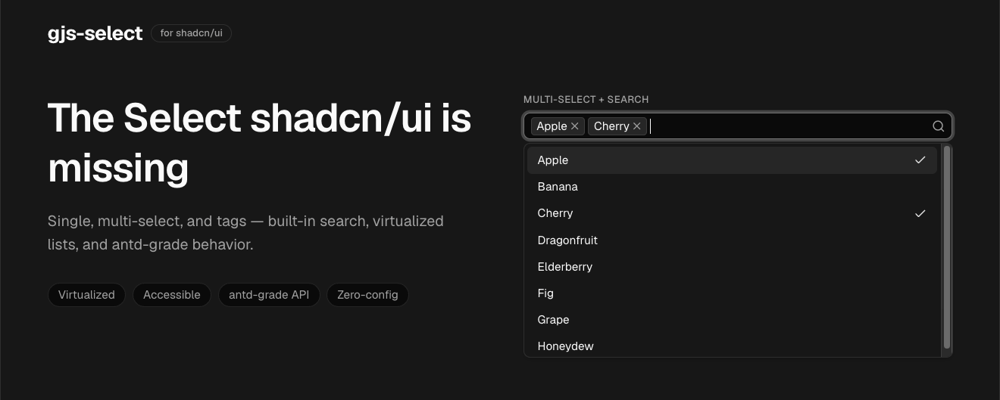

# gjs-select

**The Select shadcn/ui is missing.** A feature-complete, accessible Select for
React and shadcn/ui — single, multiple, and tags modes, built-in search,
virtualized lists, and antd-grade behavior. Installed by copy-paste with the
shadcn CLI, so the source lives in your repo and you own every line.

🔗 **[Live docs & playground →](https://gjs-select.gokhanyildiz.dev)**

[](https://gjs-select.gokhanyildiz.dev)

## Features

- **Three modes** — single, `multiple`, and `tags` (free typing with `tokenSeparators`).
- **Built-in search** — `showSearch`, custom `filterOption`/`filterSort`, `optionFilterProp`.
- **Virtualized** — thousands of options stay smooth via `@tanstack/react-virtual`; toggle with `virtual`.
- **antd-grade API** — `maxCount`, `maxTagCount` (incl. `"responsive"`), `labelInValue`, `fieldNames`, option groups, custom renderers (`optionRender`, `tagRender`, `labelRender`, `dropdownRender`).
- **Accessible** — full keyboard navigation, `role="listbox"`/`option`, managed focus, WCAG-contrast disabled state.
- **Themeable** — variants (`outlined`/`filled`/`borderless`), sizes (`small`/`middle`/`large`), `status`, RTL via `direction`, and stable `gjs-select-*` hooks on every part.
- **Zero config** — built on Radix Popover; styled with your existing shadcn/ui tokens.

## Requirements

`gjs-select` is a copy-paste shadcn/ui component, so it assumes a standard
shadcn/ui project is already in place:

- A **React 18.2+** project (React 19 supported) — Next.js, Vite, etc.
- **Tailwind CSS** with shadcn/ui tokens configured
- The shadcn **`cn` utility** (`@/lib/utils`) — installed automatically as the `utils` registry dependency

The `shadcn` CLI installs these runtime dependencies for you:

| Package | Why it's needed |
| --- | --- |
| `radix-ui` | Popover primitive — positioning, focus management, dismiss |
| `@tanstack/react-virtual` | List virtualization for large option sets |
| `class-variance-authority` | Variant / size style composition |
| `lucide-react` | Icons (chevron, check, clear ✕) |

No other shadcn components are required — `gjs-select.tsx` is self-contained.

The optional react-hook-form integration shown in the demos (`SelectFormField`) additionally needs `react-hook-form`, `zod`, and `@hookform/resolvers` — install these only if you adopt that pattern.

## Installation

```bash
npx shadcn@latest add https://gjs-select.gokhanyildiz.dev/r/gjs-select.json
```

This drops `gjs-select.tsx` into `components/ui/` and installs the runtime
dependencies listed above.

## Usage

```tsx
import { Select } from "@/components/ui/gjs-select"

const options = [
  { label: "Apple", value: "apple" },
  { label: "Banana", value: "banana" },
  { label: "Cherry", value: "cherry", disabled: true },
]

// Single
<Select options={options} placeholder="Pick a fruit" allowClear />

// Multiple, searchable
<Select mode="multiple" options={options} showSearch placeholder="Pick fruits" />

// Tags — free input split on commas
<Select mode="tags" tokenSeparators={[","]} placeholder="Add tags" />
```

Option groups, controlled/uncontrolled value, and `labelInValue`:

```tsx
<Select
  value={value}
  onChange={(v, option) => setValue(v)}
  options={[
    { label: "Fruit", options: [{ label: "Apple", value: "apple" }] },
    { label: "Veg", options: [{ label: "Carrot", value: "carrot" }] },
  ]}
/>
```

## Key props

The component mirrors the antd `Select` API. The most common props:

| Prop | Type | Description |
| --- | --- | --- |
| `options` | `SelectItem[]` | Options or option groups to render. |
| `value` / `defaultValue` | `V \| V[] \| null` | Controlled / uncontrolled value. |
| `onChange` | `(value, option) => void` | Fires on selection change. |
| `mode` | `"multiple" \| "tags"` | Multi-select or free-tag input. |
| `showSearch` | `boolean` | Enable the search input. |
| `filterOption` | `boolean \| (input, option) => boolean` | Custom client-side filtering. |
| `allowClear` | `boolean` | Show the clear (✕) affordance. |
| `disabled` / `loading` | `boolean` | Disabled / loading state. |
| `size` | `"small" \| "middle" \| "large"` | Control height. |
| `variant` | `"outlined" \| "filled" \| "borderless"` | Visual style. |
| `status` | `"error" \| "warning"` | Validation state. |
| `maxCount` | `number` | Cap selections; remaining options disable at the limit. |
| `maxTagCount` | `number \| "responsive"` | Collapse overflow tags into a `+N`. |
| `tokenSeparators` | `string[]` | Characters that split typed input into tags. |
| `direction` | `"ltr" \| "rtl"` | Text/layout direction. |
| `getPopupContainer` | `(trigger) => HTMLElement` | Render the dropdown into a custom container. |

Custom rendering (`optionRender`, `tagRender`, `labelRender`, `dropdownRender`),
`fieldNames`, `labelInValue`, `placement`, `popupMatchSelectWidth`, an imperative
ref (`focus`/`blur`/`scrollTo`), and the full event surface are also supported —
see the **[live docs](https://gjs-select.gokhanyildiz.dev)** for the complete reference.

## Styling

Because the source lives in your repo, the primary way to restyle is to **edit
`gjs-select.tsx` directly** — change the Tailwind classes to taste.

For targeted overrides without touching the source, every part carries a stable
`gjs-select-*` class and a matching `data-gjs-select-*` attribute:

```css
.gjs-select-trigger { /* the control */ }
.gjs-select-dropdown { /* the popup */ }
.gjs-select-option[data-selected] { /* selected row */ }
.gjs-select-tag { /* a tag in multiple/tags mode */ }
```

Parts: `trigger`, `selection`, `value`, `placeholder`, `prefix`, `suffix`,
`arrow`, `clear`, `search`, `tag`, `tag-close`, `overflow-tag`, `dropdown`,
`menu`, `list`, `option`, `option-check`, `option-group-label`, `empty`,
`loading`. You can also pass `className`/`style` (trigger) and
`dropdownClassName`/`dropdownStyle` (popup).

> This is a copy-paste component, not an npm package — there are no
> `classNames`/`styles` slot props on purpose. Own the source; edit it.

## License

[MIT](./LICENSE) © gokhanjs
